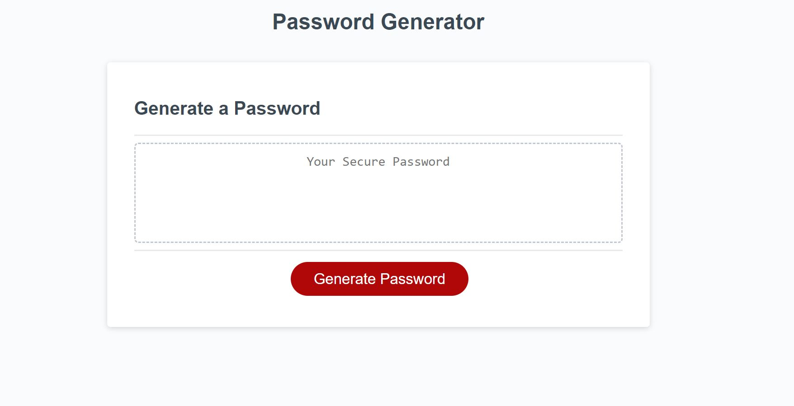
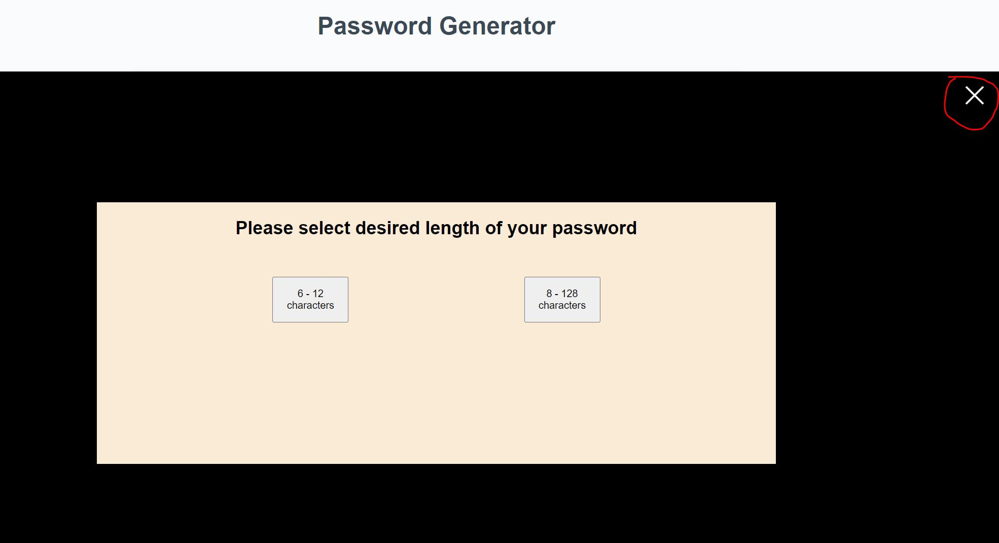
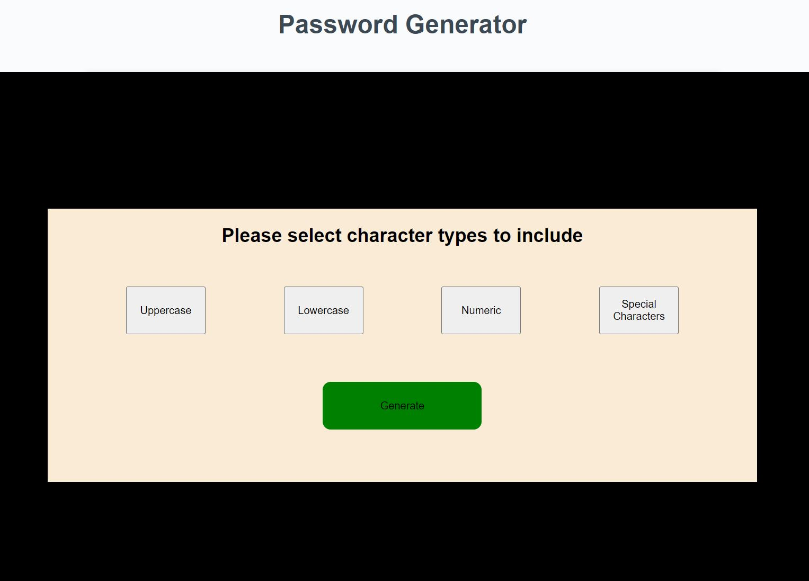
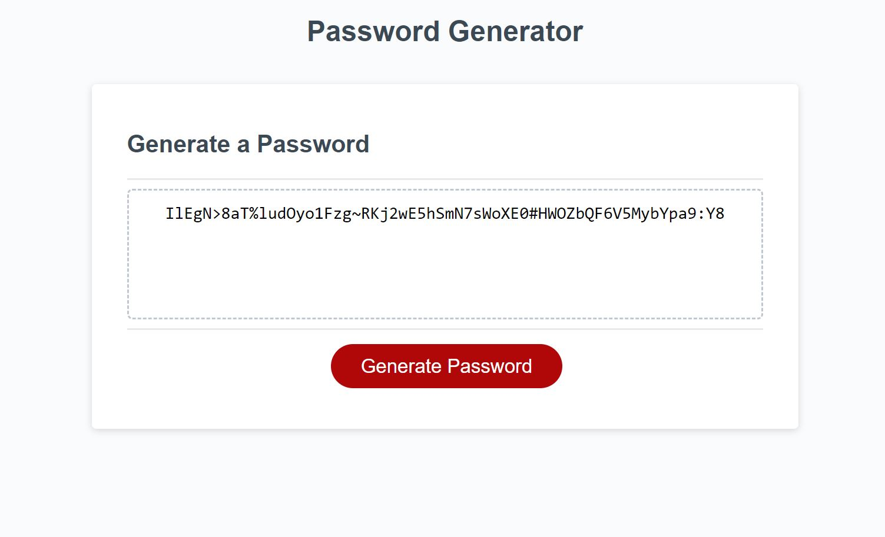
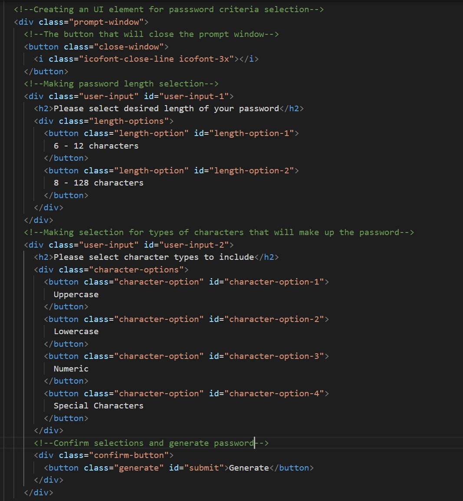

# Bootcamp-Password-Generator

## Module 3 Challenege of making a password generator.

## Description

- This password generator was built because I wanted to put the javascrpt basics I just learned into practice.

- The password generator should generate a password that is random, and is based on the criteria selections which users would make.

- There are two main criteria that the user needs to select:
  - Password length
  - Types of characters to include

* Although the feature of making criteria selections can simply be done by utilizing prompt(), confirm(), and alert(), I decided to take it up a notch and do something sligtly more advanced, which is to utilize the DOM to generate new UI elements and interact with them.

* After this amazing and fun project, it is safe to say I'm 100% familiar with the javascript basics now!

## Usage

- When the page is rendered, the user will see this:

  

- After clicking the "Generate Password" button, a prompt window will appear:

  

Notice that a close window button is on the top-right corner of the window, so the user may click on it to close the window anytime before generating the password.

- After making the length selection, a second prompt window will appear for character type selection:

  

At least one type of characters needs to be selected before the user can proceed. The same type of characters cannot be reselected once selected.

- After clicking the "Generate" button, a random password will appear inside the text area.

  

- This is the HTML code added to create the prompt windows:

  
